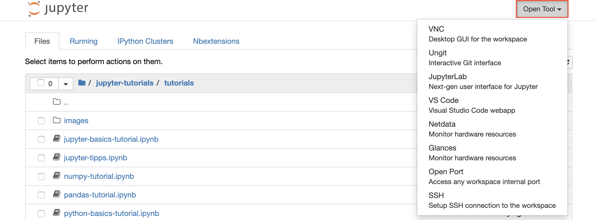
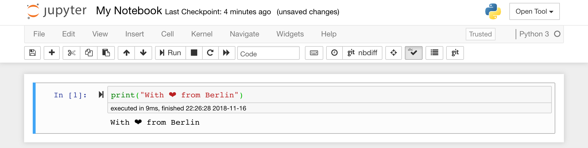
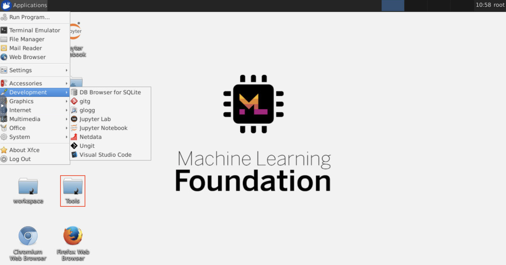
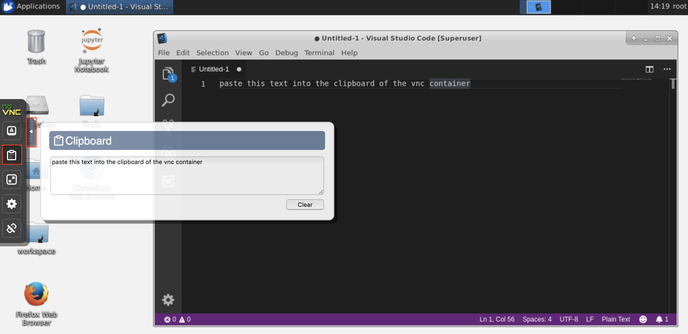
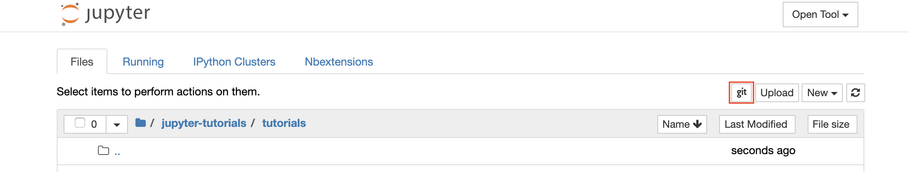
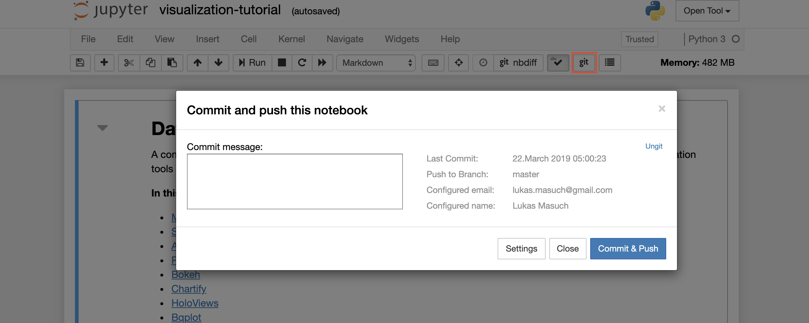
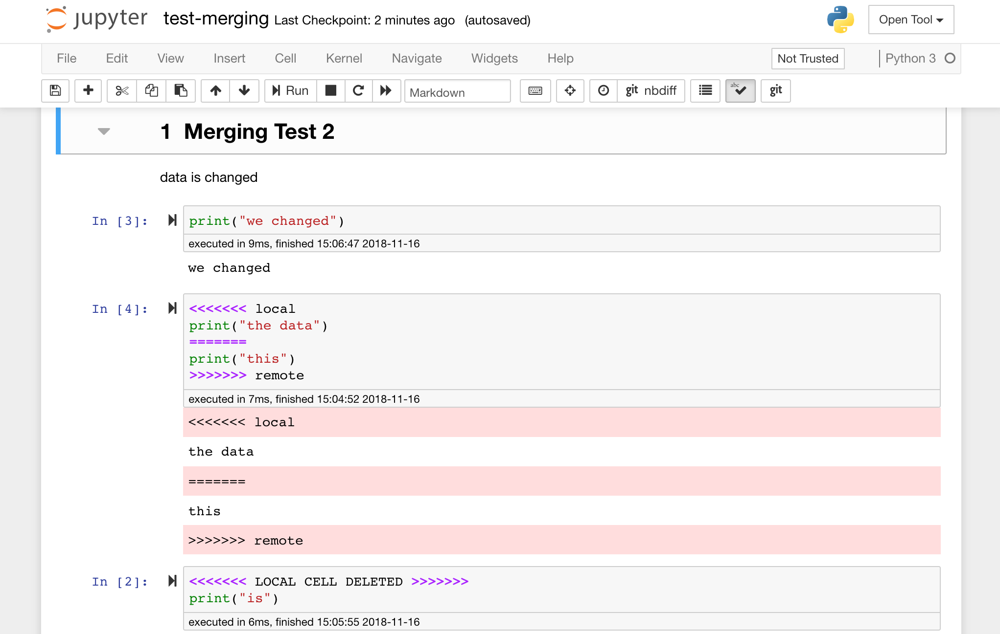
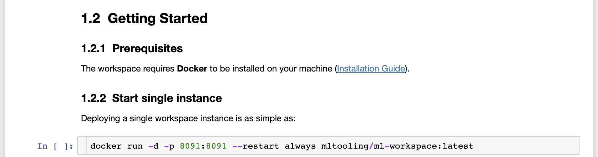
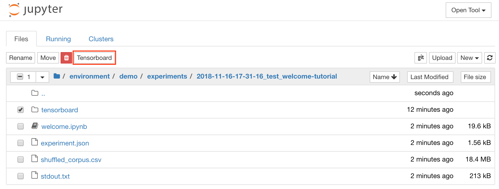

<h1 align="center">
    <a href="https://github.com/ml-tooling/ml-workspace" title="ML Workspace Home">
     </a>
    <br>
</h1>

<p align="center">
    <strong>All-in-one web-based development environment for machine learning</strong>
</p>

<p align="center">
    <a href="https://hub.docker.com/r/mltooling/ml-workspace" title="Docker Image Version"></a>
    <a href="https://hub.docker.com/r/mltooling/ml-workspace" title="Docker Pulls"></a>
    <a href="https://hub.docker.com/r/mltooling/ml-workspace" title="Docker Image Metadata"></a>
    <a href="https://github.com/ml-tooling/ml-workspace/blob/master/LICENSE" title="ML Workspace License"></a>
    <a href="https://gitter.im/ml-tooling/ml-workspace" title="Chat on Gitter"></a>
    <a href="https://twitter.com/mltooling" title="ML Tooling on Twitter"></a>
</p>

<p align="center">
  <a href="#getting-started">Getting Started</a> •
  <a href="#highlights">Highlights</a> •
  <a href="#features">Features & Screenshots</a> •
  <a href="#-where-to-ask-questions">Support</a> •
  <a href="https://github.com/ml-tooling/ml-workspace/issues/new?labels=bug&template=01_bug-report.md">Report a Bug</a> •
  <a href="#contribution">Contribution</a>
</p>

The ML workspace is an all-in-one web-based IDE specialized for machine learning and data science. It is simple to deploy and gets you started within minutes to productively built ML solutions on your own machines. This workspace is the ultimate tool for developers preloaded with a variety of popular data science libraries (e.g., Tensorflow, PyTorch, Keras, Sklearn) and dev tools (e.g., Jupyter, VS Code, Tensorboard) perfectly configured, optimized, and integrated.

## Highlights

- 💫 Jupyter, JupyterLab, and Visual Studio Code web-based IDEs.
- 🗃 Pre-installed with many popular data science libraries & tools.
- 🖥 Full Linux desktop GUI accessible via web browser.
- 🔀 Seamless Git integration optimized for notebooks.
- 📈 Integrated hardware & training monitoring via Tensoboard & Netdata.
- 🚪 Access from anywhere via Web, SSH, or VNC under a single port.
- 🎛 Usabel as remote kernel (Jupyter) or remote machine (VS Code) via SSH.
- 🐳 Easy to deploy on Mac, Linux, and Windows via Docker.

## Getting Started

### Prerequisites

The workspace requires **Docker** to be installed on your machine ([Installation Guide](https://docs.docker.com/install/#supported-platforms)).

> 📖 _If you are new to Docker, we recommend taking a look at [this awesome beginner guide](https://docker-curriculum.com/)._

### Start single instance

Deploying a single workspace instance is as simple as:

```bash
docker run -d -p 8091:8091 -v "${PWD}:/workspace" --restart always mltooling/ml-workspace:latest
```

Voilà, that was easy! Now, Docker will pull the latest workspace image to your machine. This may take a few minutes, depending on your internet speed. Once the workspace is started, you can access it via: http://localhost:8091. 

> ℹ️ _If started on a remote machine or with a different port, make sure to use the machines IP/DNS and/or the exposed port._

### Persist Data

To persist the data, you need to mount a volume into `/workspace`.

### Configuration

The container can be configured with following environment variables (`--env`):

<table>
    <tr>
        <th>Variable</th>
        <th>Description</th>
        <th>Default</th>
    </tr>
    <tr>
        <td>WORKSPACE_BASE_URL</td>
        <td>The base URL under which the notebook server is reachable. E.g. setting it to /my-workspace, the workspace would be reachable under /my-workspace/tree.</td>
        <td>/</td>
    </tr>
    <tr>
        <td>WORKSPACE_CONFIG_BACKUP</td>
        <td>Automatically backup and restore user configuration to the persisted /workspace folder, such as the .ssh, .jupyter, or .gitconfig from the users home directory.</td>
        <td>true</td>
    </tr>
    <tr>
        <td>WORKSPACE_AUTH_USER</td>
        <td>Basic auth user name. To enable basic auth, both the user and password needs to be set.</td>
        <td></td>
    </tr>
    <tr>
        <td>WORKSPACE_AUTH_PASSWORD</td>
        <td>Basic auth user password. To enable basic auth, both the user and password needs to be set.</td>
        <td></td>
    </tr>
    <tr>
        <td>WORKSPACE_SSL_ENABLED</td>
        <td>Enable or disable SSL. When set to true, either certificates (cert.crt) must be mounted to /resources/ssl or, if not, the container generates self-signed certificates.</td>
        <td>false</td>
    </tr>
    <tr>
        <td>WORKSPACE_INCLUDE_TUTORIALS</td>
        <td>If true, tutorial and introduction notebooks will be added to the workspace folder.</td>
        <td>true</td>
    </tr>
    <tr>
        <td colspan="3"><b>Jupyter Configuration:</b></td>
    </tr>
    <tr>
        <td>NOTEBOOK_ARGS</td>
        <td>Add and overwrite Jupyter configuration options via command line args. Refer to <a href="https://jupyter-notebook.readthedocs.io/en/stable/config.html">this overview</a> for all options.</td>
        <td></td>
    </tr>
    <tr>
        <td colspan="3"><b>Hardware Optimization:</b></td>
    </tr>
    <tr>
        <td>OMP_NUM_THREADS</td>
        <td>Number of threads used for MKL computations.</td>
        <td>8</td>
    </tr>
    <tr>
        <td colspan="3"><b>VNC Configuration:</b></td>
    </tr>
    <tr>
        <td>VNC_PW</td>
        <td>Password of VNC Connection.</td>
        <td>vncpassword</td>
    </tr>
    <tr>
        <td>VNC_RESOLUTION</td>
        <td>Desktop Resolution of VNC Connection.</td>
        <td>1600x900</td>
    </tr>
    <tr>
        <td>VNC_COL_DEPTH</td>
        <td>Color Depth of VNC Connection.</td>
        <td>24</td>
    </tr>
</table>

_WIP_ Add Examples

### Run multiple instances

_WIP_

## 💬 Where to ask questions

The ML Workspace project is maintained by [@LukasMasuch](https://twitter.com/LukasMasuch)
and [@raethlein](https://twitter.com/raethlein). Please understand that we won't be able
to provide individual support via email. We also believe that help is much more
valuable if it's shared publicly so that more people can benefit from it.

| Type                     | Channel                                              |
| ------------------------ | ------------------------------------------------------ |
| 🚨 **Bug Reports**       | <a href="https://github.com/ml-tooling/ml-workspace/issues?utf8=%E2%9C%93&q=is%3Aopen+is%3Aissue+label%3Abug+sort%3Areactions-%2B1-desc+" title="Open Bug Report"></a>                                 |
| 🎁 **Feature Requests**  | <a href="https://github.com/ml-tooling/ml-workspace/issues?q=is%3Aopen+is%3Aissue+label%3Afeature-request+sort%3Areactions-%2B1-desc" title="Open Feature Request"></a>                                 |
| 👩‍💻 **Usage Questions**   |  <a href="https://stackoverflow.com/questions/tagged/ml-tooling" title="Open Question on Stackoverflow"></a> <a href="https://gitter.im/ml-tooling/ml-workspace" title="Chat on Gitter"></a> |
| 🗯 **General Discussion** | <a href="https://gitter.im/ml-tooling/ml-workspace" title="Chat on Gitter"></a>  <a href="https://twitter.com/mltooling" title="ML Tooling on Twitter"></a>                  |

## Features

<p align="center">
  <a href="#jupyter">Jupyter</a> •
  <a href="#desktop-gui">Desktop GUI</a> •
  <a href="#visual-studio-code">VS Code</a> •
  <a href="#git-integration">Git Integration</a> •
  <a href="#jupyterlab">JupyterLab</a> •
  <a href="#hardware-monitoring">Hardware Monitoring</a> •
  <a href="#tensorboard">Tensorboard</a> •
  <a href="#ssh-access">SSH Access</a>
</p>

The workspace is equipped with a selection of best-in-class open-source development tools to help with the machine learning workflow. Many of these tools can be started from the `Open Tool` menu from Jupyter (the main application of the workspace):



> ℹ️ _Within your workspace you have **full root & sudo access** to install any library or tool you need via terminal (e.g., `pip` or `apt-get`)_

### Jupyter

[Jupyter Notebook](https://jupyter.org/) is a web-based interactive environment for writing and running code. The main building blocks of Jupyter are the file-browser, the notebook editor, and kernels. The file-browser provides an interactive file manager for all notebooks, files, and folders in the `/workspace` directory.


A new notebook can be created by clicking on the `New` drop-down button at the top of the list and selecting the desired language kernel.

> 💡 _You can spawn interactive **terminal** instances as well by selecting `New -> Terminal` in the file-browser._



The notebook editor enables users to author documents that include live code, markdown text, shell commands, LaTeX equations, interactive widgets, plots, and images. These notebook documents provide a complete and self-contained record of a computation that can be converted to various formats and shared with others.

> ℹ️ _This workspace has a variety of **third-party Jupyter extensions** activated. You can configure these extensions in the nbextensions configurator: `nbextensions` tab on the file browser_

The Notebook allows code to be run in a range of different programming languages. For each notebook document that a user opens, the web application starts a **kernel** that runs the code for that notebook and returns output. This workspace has a Python 3 and Python 2 kernel pre-installed. Additional Kernels can be installed to get access to other languages (e.g., R, Scala, Go) or additional computing resources (e.g., GPUs, CPUs, Memory).

> ℹ️ _**Python 2** support is deprecated and not fully supported. Please only use Python 2 if necessary!_

### Desktop GUI

This workspace provides an HTTP-based VNC access to the workspace via [noVNC](https://github.com/novnc/noVNC). Thereby, you can access and work within the workspace with a fully featured desktop GUI. To access this desktop GUI, go to `Open Tool`, select `VNC`, and click the `Connect` button. In the case you are asked for a password, use `vncpassword`.



Once you are connected, you will see a desktop GUI that allows you to install and use full-fledged web-browsers or any other tool that is available for Ubuntu. Within the `Tools` folder on the desktop, you will find a collection of install scripts that makes it straightforward to install some of the most commonly used development tools, such as Atom, PyCharm, R-Runtime, R-Studio, or Postman (just double-click on the script).

**Clipboard:** If you want to share the clipboard between your machine and the workspace, you can use the copy-paste functionality as described below:



> 💡 _**Long-running tasks:** Use the desktop GUI for long-running Jupyter executions. By running notebooks from the browser of your workspace desktop GUI, all output will be synchronized to the notebook even if you have disconnected your workspace from the notebook._

### Visual Studio Code

[Visual Studio Code](https://github.com/microsoft/vscode) (`Open Tool -> VS Code`) is an open-source lightweight but powerful code editor with built-in support for a variety of languages and a rich ecosystem of extensions. It combines the simplicity of a source code editor with powerful developer tooling, like IntelliSense code completion and debugging. The workspace integrates VS Code as a web-based application accessible through the browser based on the awesome [code-server](https://github.com/cdr/code-server) project. It allows you to customize every feature to your liking and install any number of third-party extensions.

<p align="center"></p>

### Git Integration


Version control is a crucial aspect for productive collaboration. To make this process as smooth as possible, we have integrated a custom-made Jupyter extension specialized on pushing single notebooks, a full-fledged web-based Git client ([ungit](https://github.com/FredrikNoren/ungit)), an awesome tool to open and edit plain text documents (e.g., `.py`, `.md`) as notebooks ([jupytext](https://github.com/mwouts/jupytext)), as well as a notebook merging tool ([nbdime](https://github.com/jupyter/nbdime)). Additionally, JupyterLab and VS Code also provide GUI-based Git clients.

#### Clone Repository

For cloning repositories via `https`, we recommend to navigate to the desired root folder and to click on the `git` button as shown below:



This might ask for some required settings and, subsequently, opens [ungit](https://github.com/FredrikNoren/ungit), a web-based Git client with a clean and intuitive UI that makes it convenient to sync your code artifacts. Within ungit, you can clone any repository. If authentication is required, you will get asked for your credentials.


#### Push, Pull, Merge, and Other Git Actions

To commit and push a single notebook to a remote Git repository, we recommend to use the Git plugin integrated into Jupyter as shown below:



The other tool for more advanced Git integrations is [ungit](https://github.com/FredrikNoren/ungit). With ungit, you can do most of the common git actions such as push, pull, merge, branch, tag, checkout, and many more.

#### Sharing, Diffing, and Merging Notebooks

Jupyter notebooks are great, but they often are huge files, with a very specific JSON file format. To enable seamless sharing, diffing, and merging via Git this workspace is pre-installed with [nbdime](https://github.com/jupyter/nbdime). Nbdime understands the structure of notebook documents and, therefore, automatically makes intelligent decisions when diffing and merging notebooks. In the case you have merge conflicts, nbdime will make sure that the notebook is still readable by Jupyter, as shown below:



Furthermore, the workspace comes pre-installed with [jupytext](https://github.com/mwouts/jupytext), a Jupyter plugin that reads and writes notebooks as plain text files. This allows you to open, edit, and run scripts or markdown files (e.g., `.py`, `.md`) as notebooks within Jupyter. In the following screenshot, we have opened this `README.md` file via Jupyter:



In combination with Git, jupytext enables a clear diff history and easy merging of version conflicts. With both of those tools, collaborating on Jupyter notebooks with Git becomes straightforward.

### JupyterLab

[JupyterLab](https://github.com/jupyterlab/jupyterlab) (`Open Tool -> JupyterLab`) is the next-generation user interface for Project Jupyter. It offers all the familiar building blocks of the classic Jupyter Notebook (notebook, terminal, text editor, file browser, rich outputs, etc.) in a flexible and powerful user interface. This JupyterLab instance comes pre-installed with a few helpful extensions such as a the [jupyterlab-toc](https://github.com/jupyterlab/jupyterlab-toc), [jupyterlab-git](https://github.com/jupyterlab/jupyterlab-git), and [juptyterlab-tensorboard](https://github.com/chaoleili/jupyterlab_tensorboard).


### Hardware Monitoring

The workspace provides two preinstalled web-based tools to help developers during model training and other experimentation tasks to get insights into everything happening on the system and figure out performance bottlenecks.

[Netdata](https://github.com/netdata/netdata) (`Open Tool -> Netdata`) is a real-time hardware and performance monitoring dashboard that visualize the processes and services on your Linux systems. It monitors metrics about CPU, GPU, memory, disks, networks, processes, and more.


[Glances](https://github.com/nicolargo/glances) (`Open Tool -> Glances`) is a web-based hardware monitoring dashboard as well and can be used as an alternative to Netdata.


> ℹ️ _Netdata and Glances will show you the hardware statistics for the entire machine on which the workspace container is running._

### Tensorboard

[Tensorboard](https://www.tensorflow.org/tensorboard) provides a suite of visualization tools to make it easier to understand, debug, and optimize your experiment runs. It includes logging features for scalar, histogram, model structure, embeddings, and text & image visualization. The workspace comes preinstalled with [jupyter_tensorboard extension](https://github.com/lspvic/jupyter_tensorboard) that integrates Tensorboard into the Jupyter interface with functionalities to start, manage, and stop instances. You can open a new instance for a valid logs directory as shown below:



If you have opened a Tensorboard instance in a valid log directory, you will see the visualizations of your logged data:


> ℹ️ _Tensorboard can be used in combination with many other ML frameworks besides Tensorflow. By using the [tensorboardX](https://github.com/lanpa/tensorboardX) library you can log basically from any python based library. Also, PyTorch has a direct Tensorboard integration as described [here](https://pytorch.org/docs/stable/tensorboard.html)._

If you prefer to see the tensorboard directly within your notebook, you can make use of following **Jupyter magic**:

```
%load_ext tensorboard.notebook
%tensorboard --logdir /workspace/path/to/logs
```

### SSH Access

_WIP_

### Remote Development

_WIP: Remote Kernels and VS Code remote development_

### Preinstalled Libraries and Runtimes

The workspace is pre-installed with many popular runtimes, data science libraries, and ubuntu packages:

- **Runtimes:** Anaconda 3 (Python 3.6), Java 8, NodeJS 11
- **Python libraries:** Tensorflow, Keras, Pytorch, Sklearn, CNTK, XGBoost, Theano, Fastai, and [many more](https://github.com/ml-tooling/ml-workspace/blob/master/docker-res/requirements.txt)

The full list of installed tools can be found within the [Dockerfile](https://github.com/ml-tooling/ml-workspace/blob/master/Dockerfile).

> 💡 _**An R-Runtime** installation script is provided in the `Tools` folder on the desktop of the VNC GUI._

### GPU Support

_WIP_

## Contribution

- Pull requests are encouraged and always welcome. Read [`CONTRIBUTING.md`](https://github.com/ml-tooling/ml-workspace/tree/master/CONTRIBUTING.md) and check out [help-wanted](https://github.com/ml-tooling/ml-workspace/issues?utf8=%E2%9C%93&q=is%3Aopen+is%3Aissue+label%3A"help+wanted"+sort%3Areactions-%2B1-desc+) issues.
- Submit github issues for any [feature enhancements](https://github.com/ml-tooling/ml-workspace/issues/new?assignees=&labels=feature-request&template=02_feature-request.md&title=), [bugs](https://github.com/ml-tooling/ml-workspace/issues/new?assignees=&labels=bug&template=01_bug-report.md&title=), or [documentation](https://github.com/ml-tooling/ml-workspace/issues/new?assignees=&labels=enhancement%2C+docs&template=03_documentation.md&title=) problems. 
- By participating in this project you agree to abide by its [Code of Conduct](https://github.com/ml-tooling/ml-workspace/tree/master/CODE_OF_CONDUCT.md).

<details>

<summary>Development instructions for contributors (click to expand...)</summary>

### Build

Execute this command in the project root folder to build the docker container:

```bash
python build.py --version={MAJOR.MINOR.PATCH-TAG}
```

The version is optional and should follow the [Semantic Versioning](https://semver.org/) standard (MAJOR.MINOR.PATCH). For additional script options:

```bash
python build.py --help
```

### Deploy

Execute this command in the project root folder to push the container to the configured docker registry:

```bash
python build.py --deploy --version={MAJOR.MINOR.PATCH-TAG}
```

The version has to be provided. The version format should follow the [Semantic Versioning](https://semver.org/) standard (MAJOR.MINOR.PATCH). For additional script options:

```bash
python build.py --help
```

</details>

---

Licensed **Apache 2.0**. Created and maintained with ❤️ by developers from SAP in Berlin. 